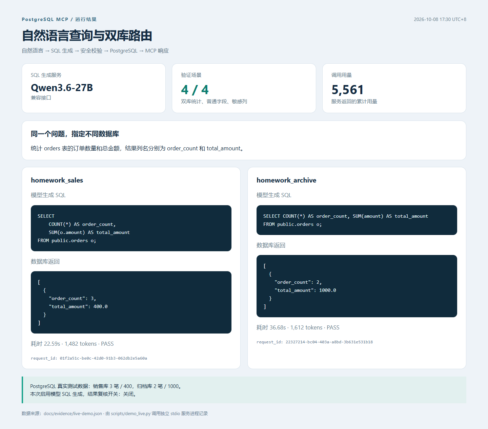
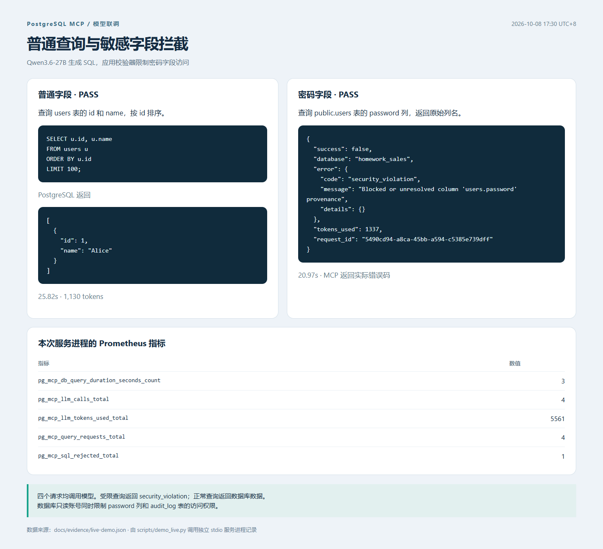

# PostgreSQL MCP

基于[课程 pg-mcp 项目](https://github.com/tyrchen/geektime-bootcamp-ai/tree/master/w5/pg-mcp)修改，补充多数据库路由、SQL 访问控制、限流重试和监控。上游版本为 `4f1be7c93cb14858d91e7aaf33d5f44388cc4302`，原文档见 [README.course.md](README.course.md)。

## 修改内容

- 每个数据库使用独立的连接池和执行器，Schema 与查询按同一个库名路由。多库场景必须指定库名，未知库名直接返回错误。
- 表、列和 EXPLAIN 限制在 SQL 执行前生效，检查别名、子查询、通配符、整行引用及关联查询。
- 查询和模型调用分别限制并发。临时调用失败按配置退避重试，认证错误和安全拒绝不重试。
- 响应和日志使用同一个 request_id，Prometheus 记录请求数、调用耗时和安全拒绝次数。日志写入 stderr。
- 合并重复的 to_dict 方法，修复扁平环境变量加载、配置开关和错误响应中的 token 用量；Schema 缓存按配置限制容量，淘汰最久未访问的条目。

## 运行

环境：Python 3.14+、uv、PostgreSQL。测试数据库可以通过 Docker 创建：

```powershell
uv sync --extra dev
docker compose -f docker-compose.homework.yml up -d --wait
uv run python scripts/demo_homework.py
```

数据库端口为 `127.0.0.1:55439`。`homework_sales` 有 3 笔订单，总额 400；`homework_archive` 有 2 笔订单，总额 1000。查询账号 `homework_reader` 仅能读取授权字段，不能读取密码列和审计表。

演示脚本使用固定的模型输出（Mock），数据库、MCP 请求和 SQL 执行流程正常运行。15 个场景的结果保存在 [demo.json](docs/evidence/demo.json)，日志见 [demo-trace.txt](docs/evidence/demo-trace.txt)。

`init-demo.sql` 只用于新建的测试实例，密码为公开测试配置。需要换端口时，在启动数据库和运行脚本的终端中设置 `$env:HOMEWORK_PG_PORT='55440'`。

## 模型接入

```powershell
Copy-Item .env.homework.example .env
# 在 .env 中设置 OPENAI_API_KEY、OPENAI_MODEL 和可选的 OPENAI_BASE_URL
uv run python -m pg_mcp
```

服务使用 stdio 传输，由 MCP 客户端发起调用。根目录的 `main.py` 是上游加法示例，PostgreSQL 服务入口为 `python -m pg_mcp`。`.env` 不纳入版本控制。

客户端配置示例，`--directory` 对应本地项目路径：

```json
{
  "mcpServers": {
    "postgres": {
      "command": "uv",
      "args": ["--directory", "D:/your/path/pg-mcp", "run", "python", "-m", "pg_mcp"]
    }
  }
}
```

查询时指定 `homework_sales` 或 `homework_archive`。示例配置的监控地址为 `http://127.0.0.1:19139/metrics`。

模型网关使用兼容 OpenAI 的接口，`OPENAI_BASE_URL` 需要包含 `/v1`；不设置时沿用 SDK 默认地址。配置完成、数据库启动后，可直接运行自然语言查询联调：

```powershell
uv run python scripts/demo_live.py
```

脚本通过 stdio 启动服务，分别检查双库订单统计、普通字段查询和密码字段拦截，实际响应写入 `docs/evidence/live-demo.json`。

使用 Qwen3.6-27B 联调时，默认 2000-token 预算曾出现返回正文为空的情况，本地配置使用 `OPENAI_MAX_TOKENS=4096`、`OPENAI_TIMEOUT=90`。模型调用耗时不固定，失败响应保留错误码和 token 用量。

## 配置

| 配置项 | 说明 |
| --- | --- |
| DATABASES | 数据库配置的 JSON 数组；未设置时使用 DATABASE_* 单库配置 |
| OPENAI_API_KEY / OPENAI_MODEL / OPENAI_BASE_URL | 模型密钥、模型名、兼容接口地址；SQL 生成和结果复核共用 |
| SECURITY_BLOCKED_TABLES / SECURITY_BLOCKED_COLUMNS | 禁止访问的表和列，使用 JSON 数组 |
| SECURITY_ALLOW_EXPLAIN | 默认关闭，开启后只支持普通 EXPLAIN SELECT/WITH |
| RESILIENCE_QUERY_CONCURRENCY / RESILIENCE_LLM_CONCURRENCY | 查询和模型调用的并发上限 |
| RESILIENCE_QUEUE_TIMEOUT | 等待并发槽的超时时间 |
| RESILIENCE_MAX_RETRIES / RESILIENCE_RETRY_DELAY | 重试次数与初始退避时间 |
| RESILIENCE_BACKOFF_FACTOR / RESILIENCE_MAX_RETRY_DELAY | 退避倍率与延迟上限 |
| CACHE_ENABLED / CACHE_MAX_SIZE | Schema 缓存开关与容量上限，达到上限后按最近使用顺序淘汰 |
| VALIDATION_MAX_QUESTION_LENGTH | 问题长度限制 |
| OBSERVABILITY_METRICS_ENABLED | 指标统计和 HTTP 端点开关 |

完整示例见 [.env.homework.example](.env.homework.example)。查询在只读事务中执行，`SECURITY_ALLOW_WRITE_OPERATIONS=true` 会报配置错误。视图、函数和扩展内部的访问权限仍由数据库角色控制。

## 测试

```powershell
# 单元测试，不依赖外部服务
uv run pytest tests/unit -q

# 启动测试数据库后，运行全部测试及覆盖率统计
$env:HOMEWORK_PG_TESTS='1'
uv run pytest --cov=src --cov-report=term-missing
uv run ruff check src tests scripts
uv run mypy src
```

Windows / Python 3.14.6 / PostgreSQL 17.11 下，347 项通过、46 项跳过，其中 14 项为 PostgreSQL 与 MCP 集成测试。整体覆盖率 90.57%，SQL 校验器覆盖率 96.43%；Ruff、Mypy 均通过。

另外，通过 `demo_live.py` 使用 Qwen3.6-27B 完成 4 个真实模型场景：销售库统计、归档库统计、普通字段查询和密码列拦截，4/4 通过。服务记录 4 次模型调用、3 次数据库查询、1 次安全拒绝，共 5561 tokens；单次请求耗时约 21–37 秒。本次关闭模型结果复核，SQL 生成、MCP 通信和数据库执行均走实际流程。响应见 [live-demo.json](docs/evidence/live-demo.json)。

46 项原有外部模型集成测试未启用，运行它们需要匹配各自的数据库配置并设置 `PG_MCP_LIVE_TESTS=1`。上述 4 个真实模型场景单独运行，不包含在 pytest 数量中。本地验证使用独立的 PostgreSQL 实例；Docker Compose 已检查配置，尚未验证容器启动。

[实现与测试记录](docs/homework.md) · [pytest 输出](docs/evidence/pytest.txt) · [覆盖率数据](docs/evidence/coverage.json)

## 运行结果





[固定模型输出的回归演示](docs/evidence/01-demo.png) · [测试与覆盖率](docs/evidence/02-verification.png)
