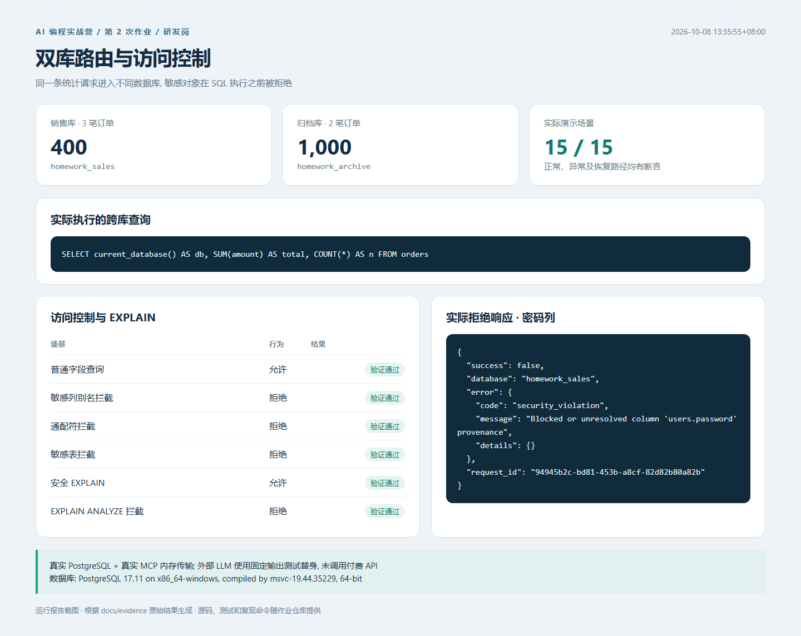
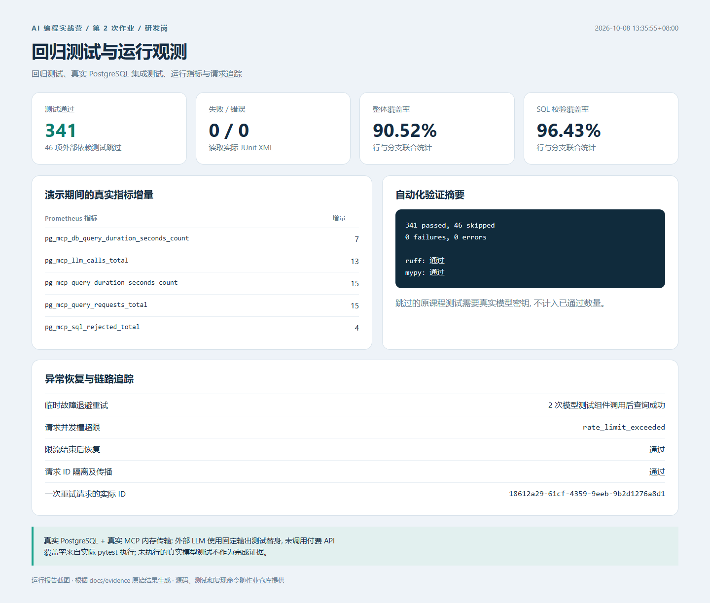

# 第二次作业：PostgreSQL MCP 功能补全与质量改进

## 作业简介（可用于提交说明）

这次作业在课程 PostgreSQL MCP 项目的基础上修改，主要处理多库查询、访问控制和请求处理流程中的问题。

原项目虽然有选库参数，但执行 SQL 时仍使用固定执行器。修改后，Schema 和执行器按同一个库名选择，用两套订单数据验证了实际查询结果。表、列和 EXPLAIN 的限制也接入了执行前的校验，并补上别名、子查询、通配符、整行引用和关联子查询的检查。

请求处理增加了查询与模型调用的并发限制，临时调用失败按配置退避重试。日志、响应通过 request_id 对应，Prometheus 记录请求次数、耗时和安全拒绝次数。此外，清理了重复的 to_dict 方法，修复配置加载和错误响应的 token 用量问题。下面的测试输出与演示数据均来自实际执行。

## 实现细节

| 问题 | 原行为 | 修复后 |
| --- | --- | --- |
| 数据库路由 | Schema 可以选库，但执行器始终固定；启动只创建单库连接池 | DATABASES 配置创建多个连接池及执行器，Schema 和 SQL 在同一目标库处理 |
| 访问控制 | 启动将 blocked_tables/blocked_columns 设置为 None | 从配置加载限制，并在 SQL 执行前检查 |
| EXPLAIN | 开关固定；允许时不校验内部 SQL | 默认禁止，开启仅支持校验后的普通 EXPLAIN SELECT/WITH，拒绝 ANALYZE 等不支持的形式 |
| 限流 | 组件存在但未接入请求 | 请求和模型分别限制并发；等待超时给出明确错误，取消/失败释放资源 |
| 重试 | SQL 纠错循环存在，但没有临时错误退避 | 区分临时与永久错误；按次数、倍率及最大延迟执行退避 |
| 可观测性 | 指标、追踪组件未贯穿主流程 | 实际记录请求、耗时、模型调用和拒绝次数，响应/阶段日志共用 request_id |
| 响应模型 | 第二个 to_dict 覆盖第一个实现 | 只保留一个序列化入口，tokens_used 始终有稳定默认值 |
| 配置与日志 | .env 的扁平配置未正确进入各子配置；日志可能占用 stdout | 配置生效并有测试，日志改为 stderr 以兼容 MCP stdio |

核心位置：`config/settings.py`、`server.py`、`services/orchestrator.py`、`services/sql_validator.py`、`models/query.py`、`resilience/`、`observability/`。

## 验证记录

本地环境：Windows、Python 3.14.6、PostgreSQL 17.11。代码来源固定为上游提交 `4f1be7c93cb14858d91e7aaf33d5f44388cc4302`。

- 全套测试：**341 通过，46 跳过，0 失败**。
- 真实 PostgreSQL + MCP 集成测试：**14 通过**，包含在全套通过数量内。
- 独立运行演示：**15/15 场景通过**。
- 行与分支联合覆盖率：整体 **90.52%**，SQL 校验器 **96.43%**。
- Ruff：通过；Mypy：31 个源文件检查通过。
- 原项目基线：247 个单元测试通过、1 个失败，Ruff/Mypy 各 4 个问题。

[完整测试输出](evidence/pytest.txt) · [JUnit XML](evidence/pytest.xml) · [覆盖率 JSON](evidence/coverage.json) · [Lint](evidence/lint.txt) · [类型检查](evidence/types.txt)

46 项跳过的原课程测试依赖真实模型密钥。本次没有该密钥，不计入已通过数量。真实数据库测试使用专门创建的演示数据，不接触业务数据库。

## 运行演示

1. 同样的“统计订单总额”问题指定 `homework_sales`，返回库名、3 笔订单、总额 400。
2. 指定 `homework_archive`，返回库名、2 笔订单、总额 1000，证明实际切换了执行器。
3. 查询普通用户字段成功；访问密码列、用户通配符、审计表返回 security_violation。
4. 普通 EXPLAIN 成功；EXPLAIN ANALYZE 被拒绝。
5. 未知库名和多库时省略库名被拒绝，均未调用模型。
6. 模拟第一次模型超时，退避后再次调用成功；安全拒绝不重试。
7. 占满并发槽时第二个请求返回 rate_limit_exceeded；槽位释放后查询恢复。
8. 请求拥有独立的 request_id，传到模型调用阶段；指标请求数实际增加 15，安全拒绝增加 4。

**边界说明：数据库、MCP 调用和应用流程均真实执行；外部模型在演示中使用固定输出测试组件。该演示未验证真实模型的自然语言理解质量，也未调用付费 API。** 原始响应见 [demo.json](evidence/demo.json)，日志见 [demo-trace.txt](evidence/demo-trace.txt)。

## 效果图

以下图片是将实际测试/运行结果渲染成报告后截取的页面，保留了验证边界和数据来源。





## 复现命令

```powershell
uv sync --extra dev
docker compose -f docker-compose.homework.yml up -d --wait
uv run python scripts/demo_homework.py
$env:HOMEWORK_PG_TESTS='1'
uv run pytest --cov=src --cov-report=term-missing --cov-report=json:docs/evidence/coverage.json --junitxml=docs/evidence/pytest.xml *> docs/evidence/pytest.txt
uv run ruff check src tests scripts *> docs/evidence/lint.txt
uv run mypy src *> docs/evidence/types.txt
uv run python scripts/render_evidence.py
```

本次电脑的 Docker 引擎不可用，因此实际验证使用了工作目录内独立启动的 PostgreSQL 二进制实例；Docker 配置提供了相同初始化数据，尚未在本机通过 Docker 启动验证。

每条检查命令执行后请确认退出码为 0，并查看对应文本文件；脚本不会替代对失败结果的判断。最后一条命令根据保存的原始结果生成报告页面，打开 `docs/evidence/01-demo.html` 与 `02-verification.html` 即可重新截图。

## 提交方法

1. 将项目源码和文档上传到自己的 GitHub / Gitee 仓库。
2. 在作业入口粘贴仓库链接；确保批改老师能够访问。
3. 上传 `docs/evidence/01-demo.png` 与 `docs/evidence/02-verification.png`。
4. 需要文字说明时，可使用本文件“作业简介”，并保留真实模型尚未验证的说明。

## 限制与后续改进

- 并发限流不是按用户/每秒配额限流；当前作业为单进程服务。
- SQL AST 校验采取保守策略，不支持的复杂来源会被拒绝；数据库最小权限仍是最终防线。
- 视图、自定义函数、扩展内部权限需由数据库角色控制，不能依赖 SQL 字符串检查兜底。
- tokens_used 默认 0 表示未采集，不等于真实模型没有计费；结果复核关闭或遇到非资源类错误降级时，沿用原项目的 confidence=100 默认值，不代表真实复核通过或实际准确率。
- 生产部署、真实模型效果及分布式限流不在本次已验证范围。
